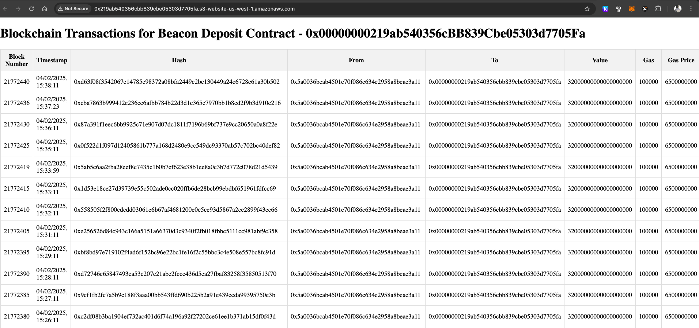

# fuzzy-spoon

This project demonstrates the use of Terraform to create an S3 bucket and host a static website, along with utilizing GitHub Actions to run a Python script for fetching blockchain transactions for the Beacon Deposit Contract from Etherscan.

## Overview

- **Terraform** is used to create an S3 bucket.
- During the bucket creation, the `index.html` file is copied to the S3 bucket.
- **GitHub Actions** is utilized instead of an EC2 instance to run a Python script (`tx.py`) that fetches blockchain transactions and saves them to `transactions.json`.
- The `transactions.json` file is then copied to the S3 bucket.
- The `index.html` file is served from the S3 bucket as a static site, displaying the blockchain transactions.

## Steps

1. **Terraform Configuration**:
    - The S3 bucket is created using Terraform.
    - The `index.html` file is uploaded to the S3 bucket during the creation process.

2. **GitHub Actions**:
    - A GitHub Action is set up to run the Python script (`tx.py`) every hour.
    - The script fetches blockchain transactions and saves them to `transactions.json`.
    - The `transactions.json` file is then copied to the S3 bucket.

3. **Static Website**:
    - The `index.html` file in the S3 bucket is served as a static website.
    - The website displays the blockchain transactions fetched by the Python script.

## Keeping it Simple

The solution is designed to be simple and straightforward, leveraging Terraform for infrastructure management and GitHub Actions for automation, avoiding the need for an EC2 instance.

## Files

- `main.tf`: Terraform configuration for creating the S3 bucket and uploading `index.html`.
- `tx.py`: Python script to fetch blockchain transactions.
- `index.html`: HTML file served as a static website from the S3 bucket.
- `.github/workflows/main.yml`: GitHub Actions workflow to run the Python script and update `transactions.json`.

## Usage

1. **Set up Terraform**:
    - Initialize and apply the Terraform configuration to create the S3 bucket and upload `index.html`.

2. **Configure GitHub Actions**:
    - Ensure the GitHub repository has the necessary secrets for AWS access.
    - The GitHub Action will automatically run the Python script every hour and update `transactions.json` in the S3 bucket.

3. **Access the Static Website**:
    - The static website URL is output by Terraform and can be accessed to view the blockchain transactions.

Enjoy your simple and efficient solution for hosting a static website with dynamic blockchain transaction data!


Terraform command logs:
```terraform
fuzzy-spoon git:(master) terraform apply

Terraform used the selected providers to generate the following execution plan. Resource actions are indicated with the following symbols:
  + create
 <= read (data resources)

Terraform will perform the following actions:

  # data.aws_iam_policy_document.website_policy will be read during apply
  # (config refers to values not yet known)
 <= data "aws_iam_policy_document" "website_policy" {
      + id            = (known after apply)
      + json          = (known after apply)
      + minified_json = (known after apply)

      + statement {
          + actions   = [
              + "s3:GetObject",
            ]
          + resources = [
              + (known after apply),
            ]

          + principals {
              + identifiers = [
                  + "*",
                ]
              + type        = "*"
            }
        }
    }

  # aws_s3_bucket.website_bucket will be created
  + resource "aws_s3_bucket" "website_bucket" {
      + acceleration_status         = (known after apply)
      + acl                         = (known after apply)
      + arn                         = (known after apply)
      + bucket                      = "0x219ab540356cbb839cbe05303d7705fa"
      + bucket_domain_name          = (known after apply)
      + bucket_prefix               = (known after apply)
      + bucket_regional_domain_name = (known after apply)
      + force_destroy               = true
      + hosted_zone_id              = (known after apply)
      + id                          = (known after apply)
      + object_lock_enabled         = (known after apply)
      + policy                      = (known after apply)
      + region                      = (known after apply)
      + request_payer               = (known after apply)
      + tags_all                    = (known after apply)
      + website_domain              = (known after apply)
      + website_endpoint            = (known after apply)

      + cors_rule (known after apply)

      + grant (known after apply)

      + lifecycle_rule (known after apply)

      + logging (known after apply)

      + object_lock_configuration (known after apply)

      + replication_configuration (known after apply)

      + server_side_encryption_configuration (known after apply)

      + versioning (known after apply)

      + website (known after apply)
    }

  # aws_s3_bucket_policy.website_policy will be created
  + resource "aws_s3_bucket_policy" "website_policy" {
      + bucket = (known after apply)
      + id     = (known after apply)
      + policy = (known after apply)
    }

  # aws_s3_bucket_public_access_block.website_bucket_access will be created
  + resource "aws_s3_bucket_public_access_block" "website_bucket_access" {
      + block_public_acls       = false
      + block_public_policy     = false
      + bucket                  = (known after apply)
      + id                      = (known after apply)
      + ignore_public_acls      = false
      + restrict_public_buckets = false
    }

  # aws_s3_bucket_website_configuration.website_config will be created
  + resource "aws_s3_bucket_website_configuration" "website_config" {
      + bucket           = (known after apply)
      + id               = (known after apply)
      + routing_rules    = (known after apply)
      + website_domain   = (known after apply)
      + website_endpoint = (known after apply)

      + index_document {
          + suffix = "index.html"
        }

      + routing_rule (known after apply)
    }

  # aws_s3_object.index will be created
  + resource "aws_s3_object" "index" {
      + acl                    = (known after apply)
      + arn                    = (known after apply)
      + bucket                 = (known after apply)
      + bucket_key_enabled     = (known after apply)
      + checksum_crc32         = (known after apply)
      + checksum_crc32c        = (known after apply)
      + checksum_sha1          = (known after apply)
      + checksum_sha256        = (known after apply)
      + content_type           = "text/html"
      + etag                   = (known after apply)
      + force_destroy          = false
      + id                     = (known after apply)
      + key                    = "index.html"
      + kms_key_id             = (known after apply)
      + server_side_encryption = (known after apply)
      + source                 = "index.html"
      + storage_class          = (known after apply)
      + tags_all               = (known after apply)
      + version_id             = (known after apply)
    }

Plan: 5 to add, 0 to change, 0 to destroy.

Changes to Outputs:
  + website_url = "http://0x219ab540356cbb839cbe05303d7705fa.s3-website-us-west-1.amazonaws.com"

Do you want to perform these actions?
  Terraform will perform the actions described above.
  Only 'yes' will be accepted to approve.

  Enter a value: yes

aws_s3_bucket.website_bucket: Creating...
aws_s3_bucket.website_bucket: Creation complete after 6s [id=0x219ab540356cbb839cbe05303d7705fa]
data.aws_iam_policy_document.website_policy: Reading...
aws_s3_bucket_public_access_block.website_bucket_access: Creating...
aws_s3_bucket_website_configuration.website_config: Creating...
data.aws_iam_policy_document.website_policy: Read complete after 0s [id=3083432177]
aws_s3_object.index: Creating...
aws_s3_bucket_policy.website_policy: Creating...
aws_s3_bucket_public_access_block.website_bucket_access: Creation complete after 1s [id=0x219ab540356cbb839cbe05303d7705fa]
aws_s3_object.index: Creation complete after 1s [id=index.html]
aws_s3_bucket_policy.website_policy: Creation complete after 1s [id=0x219ab540356cbb839cbe05303d7705fa]
aws_s3_bucket_website_configuration.website_config: Creation complete after 1s [id=0x219ab540356cbb839cbe05303d7705fa]

Apply complete! Resources: 5 added, 0 changed, 0 destroyed.

Outputs:

website_url = "http://0x219ab540356cbb839cbe05303d7705fa.s3-website-us-west-1.amazonaws.com"
```
